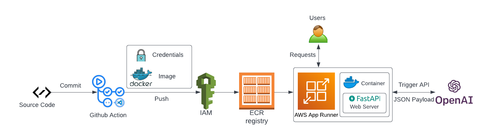
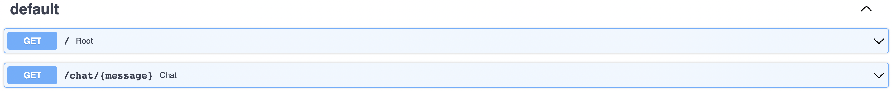
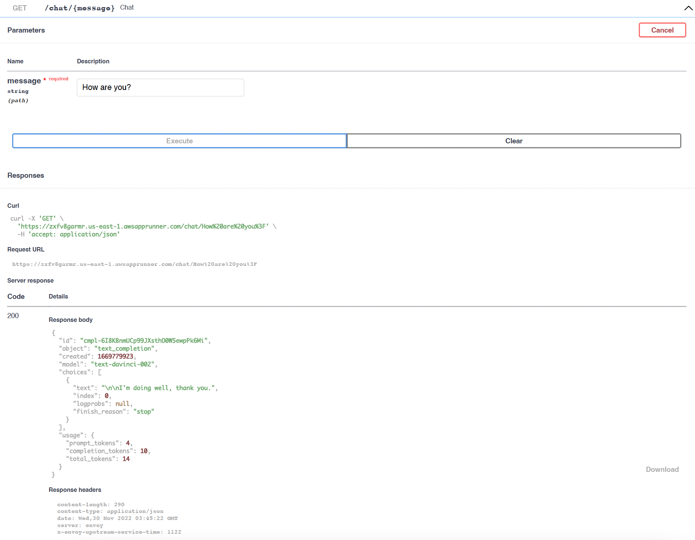

# zilin-proj4
This is the repository for project 4 for the course IDS706 at Duke University

## How to use
The web service is being deployed and maintained on AWS AppRunner, and here is the link:
https://zxfv8garmr.us-east-1.awsapprunner.com/

## Project Description
This is a FastAPI web application that allows users to interact with server APIs by sending out messages, and the server will contact OpenAI API and get response in format of JSON payload correspondent to the messages back to the users, mimicing real talkings between human beings. Users then could utilize the sent back response to perform any work they like.

This project adopts Github Actions for its CI/CD. The web service runs on AWS AppRunner. Code commit would automaticlly update the web service running on AWS AppRunner to its latest version, which makes sure that the service is always up to date.

## Flow Diagram

## Examples
There are two main routings here for this web application, they are / (root) and /chat/{message} (chat), where "message" is what user pass in to talk to the web service and OpenAI. The APIs are shown here:

Below is the example of how to use the chat API of the web service:

The response is sent in format of JSON payload. As mentioned before, users could utilize the JSON formatted response to perform any work of their preference.